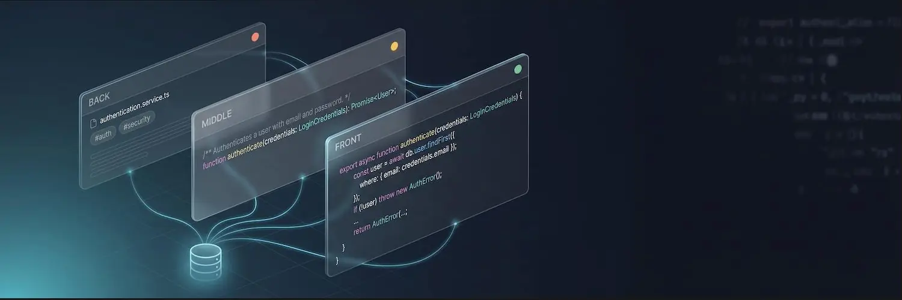

# coderecall

> Your repo's memory, indexed locally. One SQLite file. Zero API keys.

<p align="center">
  
</p>

[](https://opensource.org/licenses/MIT)
[](https://modelcontextprotocol.io)
[](#)
[](https://bun.sh)

**coderecall** is an MCP server that turns any local repo into a searchable index your AI coding agent can query directly — code *and* the notes, decisions, and patterns you've accumulated about it. It runs entirely on your laptop. No OpenAI key. No Ollama. No vector DB to host. Vendor it into your project, run init, restart Claude Code.

- **Confidence-tiered context.** Searches return full content for high-confidence hits, summaries for medium, and metadata-only stubs for the rest — so the model spends tokens where it's confident, not everywhere.
- **Knows when it's stale.** Every search response embeds a banner the agent can see (`🟡 Index is 17 days old`), so the model can prompt you to reindex instead of silently searching old code.
- **Code + knowledge in one call.** `add_knowledge("we use SWR not React Query because…")` lives next to your source in the same index, retrieved by the same `search` tool.
- **6 languages with real parsers** — TypeScript/JavaScript, Python, Go, Rust, Ruby, Elixir — plus a generic fallback. Adding a new one is a single file.
- **Truly local.** Embeddings run in-process via `Xenova/bge-small-en-v1.5` (384-D, ~30 MB on first run). Index lives in a single `.coderecall/index.db` — gitignored per developer, vectors never travel through git. The tool itself is vendored at `tools/coderecall/` and committed, so the whole team stays on the same pinned version.

---

## How it compares

| | **coderecall** | claude-context | basic-memory | continue.dev `@codebase` |
|---|---|---|---|---|
| Local-only, no API key | ✅ | ❌ (needs embedder + Milvus) | ✅ | ✅ (deprecated) |
| Indexes code | ✅ | ✅ | ❌ | ✅ |
| Stores notes / decisions alongside code | ✅ | ❌ | ✅ (separate) | ❌ |
| Single-file SQLite — no daemon, no Docker | ✅ | ❌ | ❌ | ❌ |
| Tells the agent when the index is stale | ✅ | ❌ | ❌ | ❌ |
| `git diff` aware incremental reindex | ✅ | partial | n/a | ❌ |
| Works with any MCP client | ✅ | ✅ | ✅ | ❌ (VS Code extension) |

---

## Quick start

**coderecall is vendored per project** — its source lives at `<your-project>/tools/coderecall/`, gets committed alongside your code, and every dev shares the same pinned version. The local index (`.coderecall/`) and `tools/coderecall/node_modules/` are gitignored automatically by `init`.

### 🤖 Agent-first (recommended)

Open Claude Code (or Cursor) inside the project you want to give a memory to, and paste this prompt:

```
Set up coderecall (https://github.com/FedeMadoery/coderecall) in this project: install bun if it's missing, vendor the repo into ./tools/coderecall with `bunx degit FedeMadoery/coderecall tools/coderecall` (so no nested .git), run `bun install` inside tools/coderecall, then from this project's root run `bun ./tools/coderecall/scripts/cli.ts init && bun ./tools/coderecall/scripts/cli.ts index`. Append the "Code Memory" snippet from the repo's README to my CLAUDE.md (create it if missing), then tell me to restart so the mcp__coderecall__search tools load. Don't commit or push anything.
```

The agent vendors the tool into `./tools/coderecall`, wires it into this project's `.mcp.json` with a portable relative path, runs the first index (~30 MB model download), and updates `CLAUDE.md`. Restart Claude Code when it's done.

### Manual

```bash
# 1. Install bun (one-time)
curl -fsSL https://bun.sh/install | bash

# 2. From your project root, vendor coderecall into ./tools/coderecall
bunx degit FedeMadoery/coderecall tools/coderecall
cd tools/coderecall && bun install && cd ../..

# 3. Wire it into the project (writes .coderecall.json + a relative .mcp.json entry)
bun ./tools/coderecall/scripts/cli.ts init

# 4. Index the codebase (downloads ~30 MB embedding model on first run)
bun ./tools/coderecall/scripts/cli.ts index

# 5. Restart Claude Code (or Cursor). The `mcp__coderecall__search` tools appear.

# 6. Commit ./tools/coderecall — its node_modules is gitignored, your team gets a pinned version.
git add tools/coderecall .gitignore .coderecall.json .mcp.json
git commit -m "Add coderecall MCP server"
```

> **Tip:** `alias coderecall="bun ./tools/coderecall/scripts/cli.ts"`, then `coderecall init`, `coderecall index`, `coderecall search "..."`.

**Updating coderecall**: re-run `bunx degit FedeMadoery/coderecall tools/coderecall --force && cd tools/coderecall && bun install` to pull the latest version. Diff and commit — your team gets the update on next pull.

### Recommended `CLAUDE.md` note

Add this to your project's `CLAUDE.md` so the agent reaches for the tool first:

```md
## Code Memory

Before reading source files directly, **search the index first**:

  mcp__coderecall__search("how does authentication work")

Use `filter: "code"` or `filter: "knowledge"` to narrow. The index covers
this repo and any knowledge entries added via `add_knowledge`.
```

---

## MCP tools exposed

| Tool | Purpose |
|---|---|
| `search` | Confidence-tiered search — returns full / summary / metadata tiers. **Use this by default.** |
| `search_memory` | Same hybrid search, always returns full content. |
| `add_knowledge` | Store a knowledge entry (`architecture` / `decision` / `pattern` / `note` / `troubleshooting`). |
| `list_knowledge` | List entries, optionally filtered by category or tag. |
| `index_files` | Index a path. Defaults to extensions from `.coderecall.json`. |
| `index_diff` | Index only files changed between two git refs — fastest way to refresh after a branch switch or `git pull`. |
| `get_file_context` | List every chunk in a file with line ranges and signatures. |
| `get_index_stats` | File count, chunk count, knowledge count, last-indexed timestamp. |

---

## How confidence-tiered context works

The `search` tool retrieves 5× the requested number of candidates, scores them with FTS5 keyword + cosine vector + recency, enforces diversity (max 3 chunks per file), then expands each result into one of three tiers:

| Tier | Score | What you get |
|---|---|---|
| 🟢 Full | ≥ 0.7 | Complete content |
| 🟡 Summary | 0.4 – 0.7 | Signature + first docstring line |
| 🔴 Metadata | < 0.4 | Title, filepath, tags |

That trade-off is the point: you spend context on results the model is *confident* about, and keep low-confidence hits visible (cheap) so the model can request expansion if needed.

---

## What `init` does

`coderecall init` writes (or updates) three things in your project:

| File | What it is |
|---|---|
| `.coderecall.json` | Project config: indexed extensions, ignore globs, embedding model, staleness thresholds. |
| `.mcp.json` (or `.cursor/mcp.json` with `--client cursor`) | MCP server entry for `coderecall`. Merges next to any existing servers — won't clobber. |
| `.gitignore` | Appends `.coderecall/` (and `tools/coderecall/node_modules/` for vendored installs). |

The `.mcp.json` entry adapts to where coderecall lives:

- **Vendored** (the recommended setup — coderecall is inside the project at `tools/coderecall/`): server path is written as a portable relative path (`./tools/coderecall/src/index.ts`) and the `CODERECALL_PROJECT_ROOT` env var is omitted — the server uses the MCP client's launch CWD. The result is fully portable: commit `.mcp.json` and every teammate's setup works without path rewrites.
- **External** (coderecall lives somewhere outside the project): server path is absolute, and `CODERECALL_PROJECT_ROOT` is set explicitly.

It auto-detects the project language by scanning for a manifest file (`mix.exs`, `Cargo.toml`, `go.mod`, `pyproject.toml` / `requirements.txt` / `Pipfile`, `Gemfile`, `tsconfig.json`, `package.json`) and picks sensible default extensions. Re-run with `--force` to overwrite, `--no-mcp` to skip the MCP file, or pass a path: `coderecall init /path/to/project`.

---

## Indexing & re-indexing

The index is **local per developer**. `.coderecall/` is gitignored — vectors are never shared via git. Every teammate runs indexing on their own machine against their own checkout.

### First-time indexing

```bash
coderecall index
```

Scans the project, parses every file matching `extensions`, chunks it, embeds each chunk (384-D), and stores everything in `.coderecall/index.db`. The first run also downloads the ~30 MB embedding model. Rough numbers on CPU: ~30–50 ms per chunk; a 5,000-chunk repo finishes its first index in ~4–5 min.

### Re-indexing is cheap

`coderecall index` is **content-hash-aware**: every file's SHA-256 is stored, and unchanged files are skipped instantly. Running `coderecall index` against a fully-up-to-date repo finishes in under a second. So the safe default after a work session is to just re-run it.

The one thing a full `index` does **not** handle is **deleted or renamed files** — chunks for files that no longer exist stay in the DB. Use `index-diff` (which inspects `git diff --name-status`) or nuke `.coderecall/` when that matters.

### When to run what

| Situation | Command |
|---|---|
| You edited some files | `coderecall index` |
| You deleted, moved, or renamed files | `coderecall index-diff . --base HEAD~1 --head HEAD` |
| You just `git pull`ed teammate work | `coderecall index-diff . --base ORIG_HEAD --head HEAD` |
| You switched branches | `coderecall index-diff . --base <prev-branch> --head HEAD` |
| You changed `extensions` or `ignore` in config | `rm -rf .coderecall && coderecall index` |
| You changed `embeddingModel` | `rm -rf .coderecall && coderecall index` |

### Staleness alerts

The server tracks **when the last full index run completed** and surfaces age in every search response. Two thresholds are configurable in `.coderecall.json`:

```json
"staleAfterDays": 14,
"veryStaleAfterDays": 30
```

Past the first threshold, every search response prefixes a yellow banner:

```
🟡 Index is 17 days old (threshold: 14d). Consider `coderecall index` to refresh.
```

Past the second, it turns red. **The point is that the agent sees the warning** and can suggest a reindex instead of silently searching against a stale snapshot.

### Knowledge entries

Knowledge entries created via `add_knowledge`, `import-obsidian`, or `import-knowledge-file` are embedded **the moment they're added** — no separate reindex step. They live in the same SQLite DB and are searched alongside code by default.

### Automating it

No file watcher is built in — re-indexing while a tool is reading from the DB can race. Pick whichever fits your workflow:

- **Manual** — just run `coderecall index` before searching, after a work session.
- **Git `post-commit` hook** — cheap on every commit thanks to content-hash skipping:
  ```bash
  # .git/hooks/post-commit
  coderecall index >/dev/null 2>&1 &
  ```
- **Editor task** — bind a key in VS Code / your editor to `coderecall index`.

---

## Architecture

| Layer | What it does |
|---|---|
| **MCP tools** | search · add_knowledge · index_files · index_diff · get_file_context · get_index_stats |
| **Confidence-tiered retrieval** | pool → scoring → diversity → tiered expansion |
| **Hybrid search** | FTS5 (porter) + cosine 384-D |
| **Indexing** | scanner → parsers → chunker → embeddings |
| **SQLite** | knowledge_entries · code_files · code_chunks · embeddings · memory_fts |

### Adding a language

A new language is **a single file** in `src/indexer/parsers/<lang>.ts` implementing the `LanguageParser` interface (regex or tree-sitter — your call), then a one-line entry in `src/indexer/parsers/index.ts`. PRs welcome.

---

<details>
<summary><strong>CLI reference</strong></summary>

```bash
coderecall init [path]                   # plug-and-play setup
coderecall index [path]                  # full index of project (uses config)
coderecall index-diff [path] --base HEAD~1 --head HEAD
coderecall search "<query>" [--filter code|knowledge] [--limit 10] [--expansion selective|all|metadata_only]
coderecall search-legacy "<query>"       # full-expansion mode (no tiering)
coderecall stats
coderecall add-knowledge                 # interactive
coderecall list-knowledge [--category X] [--tag Y]
coderecall import-obsidian --vault /path/to/vault
coderecall import-knowledge-file ./NOTES.md --category note
```

All commands honor `CODERECALL_PROJECT_ROOT`, `CODERECALL_INDEX_PATH`, `CODERECALL_EXTENSIONS`, `CODERECALL_IGNORE`, and `CODERECALL_EMBEDDING_MODEL`.

</details>

<details>
<summary><strong>Config (<code>.coderecall.json</code>)</strong></summary>

```json
{
  "indexPath": ".coderecall",
  "extensions": [".ts", ".tsx", ".js", ".jsx"],
  "ignore": [
    "**/node_modules/**", "**/dist/**", "**/build/**",
    "**/.next/**", "**/.git/**", "**/.coderecall/**"
  ],
  "embeddingModel": "Xenova/bge-small-en-v1.5",
  "staleAfterDays": 14,
  "veryStaleAfterDays": 30
}
```

- `indexPath` — where the SQLite DB lives. Relative paths resolve from the project root.
- `extensions` — what gets parsed. Anything not in the language registry falls back to a generic block chunker.
- `ignore` — glob patterns excluded during scanning.
- `embeddingModel` — defaults to `Xenova/bge-small-en-v1.5` (384-D, ~30 MB). Any other 384-D model is a drop-in. Switching to a different dimension (e.g. `Xenova/bge-base-en-v1.5` at 768-D) requires reindexing — old vectors are silently incompatible.
- `staleAfterDays` / `veryStaleAfterDays` — yellow / red staleness banner thresholds. Defaults: 14 / 30.

</details>

<details>
<summary><strong>Troubleshooting</strong></summary>

**MCP tools don't appear after `init`** — restart your MCP client. Claude Code reloads `.mcp.json` on launch.

**Search returns nothing** — run `coderecall stats`. If `Total chunks` is 0, run `coderecall index`.

**Search returns stale results / deleted files** — full `index` doesn't clean deletions. Run `coderecall index-diff` or `rm -rf .coderecall && coderecall index`.

**First search/index is slow** — first run downloads the ~30 MB embedding model. Subsequent runs use the local cache.

**Type errors when editing** — `bun install && bunx tsc --noEmit`.

</details>

---

## Acknowledgments

The confidence-tiered expansion idea is loosely inspired by recent RAG-decoding research (notably Meta's REFRAG paper on selective chunk expansion), adapted here as a simple retrieval-side scoring heuristic rather than a learned decoder modification.

## Credits

<table>
  <tr>
    <td align="center">
      <a href="https://github.com/jichon">
        <br/>
        <sub><b>@jichon</b></sub>
      </a><br/>
      <sub>Original idea</sub>
    </td>
    <td align="center">
      <a href="https://github.com/FedeMadoery">
        <br/>
        <sub><b>@FedeMadoery</b></sub>
      </a><br/>
      <sub>Author &amp; maintainer</sub>
    </td>
  </tr>
</table>

[**@jichon**](https://github.com/jichon) originally conceived the idea this project is based on — he sketched it out for a single use case, and this repo generalizes it into a reusable tool.

## License

MIT
